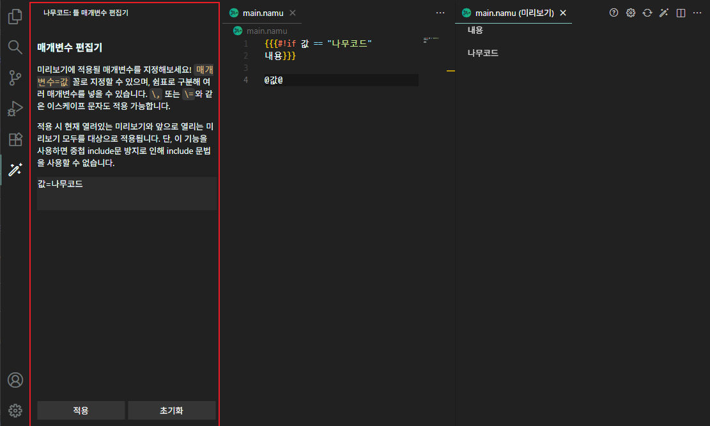

# 나무코드 Namucode

[나무위키](https://namu.wiki)에 내장된 Monaco 편집기에 영감을 받은 Visual Studio Code 확장 프로그램입니다. 더 강력한 텍스트 강조, 자동완성, 문서 미리보기 등 여러 기능을 즐겨보세요!

  - [설치](#설치)
  - [사용법](#사용법)
  - [기능](#기능)
    - [텍스트 강조 기능](#텍스트-강조-기능)
    - [미리보기](#미리보기)
    - [틀 매개변수 편집기](#틀-매개변수-편집기)
    - [코드 분석 기능](#코드-분석-기능)
    - [문단 자동 정렬 기능](#문단-자동-정렬-기능)
    - [자동완성 기능](#자동완성-기능)
    - [커맨드 기능](#커맨드-기능)
    - [목차 표시 기능](#목차-표시-기능)
  - [설정](#설정)
    - [파서 설정](#파서-설정)
    - [미리보기 설정](#미리보기-설정)
  - [저작권 고지](#저작권-고지)
  - [기여](#기여)
  - [업데이트 로그](#업데이트-로그)
  - [참고](#참고)

## 설치

나무코드는 Visual Studio Code 확장 프로그램으로, [Visual Studio Code Marketplace](https://marketplace.visualstudio.com/items?itemName=jhk1090.namucode)에서 다운로드 가능합니다.

## 사용법

1. 나무코드를 설치합니다. (상단 **설치** 항목 참고)
1. 설치 후 언어칸에서 '나무마크'를 선택하거나 파일 확장자를 `.namu`로 바꿔줍니다.
1. 설정이 끝났으며 나무마크 문법을 사용해보세요!

|  |
| :----: |
| 선택란 |

## 기능

### 텍스트 강조 기능

나무코드는 텍스트 강조(Syntax Highlighting)를 지원합니다. 나무위키의 Monaco 에디터보다 더 세세한 강조가 지원됩니다. 아래 두 사진을 비교해보세요!

|  |  |
| :----: | :----: |
| 나무위키 편집기 | **나무코드 편집기** |

그 외에도 `[math()]` 문법에서 사용되는 LaTeX 문법의 텍스트를 강조하거나, `#!syntax` 문법에서 언어에 맞는 문법 강조를 지원합니다!

> 단, `#!syntax` 문법에서 `erlang`, `Kotlin`, `lisp`을 선택하는 경우 VSCode 자체에서 내장된 텍스트 강조 기능이 존재하지 않아, 언어에 맞는 확장 프로그램을 설치해야 하며, 설치 시 작동됩니다.

### 미리보기
**▶ 자세한 정보는 [미리보기 가이드](./docs/preview.md) 항목을 참고하세요.**

나무코드는 미리보기를 지원합니다. `F1`을 눌러 **나무코드: 미리보기** 옵션을 누르거나 `*.namu` 파일의 오른쪽 상단에 위치한 미리보기 아이콘을 눌러 미리보기를 조회할 수 있습니다. 미리보기 기능은 the seed 엔진을 모방한 [the tree](https://github.com/wjdgustn/thetree) 엔진 위에서 돌아갑니다.

|  |  |
| :----: | :----: |
| 미리보기 아이콘 위의 **빨간색 네모**로 표시된 아이콘 | 미리보기 예시 |

### 틀 매개변수 편집기
**▶ 자세한 정보는 [미리보기 가이드](./docs/preview.md)의 [틀 매개변수 편집기](./docs/preview.md#틀-매개변수-편집기) 항목을 참고하세요.**

|  |
| :---: |
| 틀 매개변수 편집기 사용례 기본 왼쪽 Activity Bar의 마법봉 아이콘을 눌러 표시할 수 있음 **빨간색 네모**로 표시된 부분이 편집기 |

### 코드 분석 기능
나무코드는 코드 분석 기능을 지원합니다. 간단한 분석을 통해 교정할 수 있는 문법 등을 강조해 표시합니다.
현재 코드 분석을 통해 강조를 지원하는 구문은 다음과 같습니다.

<!-- - **고정 주석 강조** - `##@`를 사용한 고정 주석을 강조합니다. -->
- **비권장 문법 경고 표시** - 나무위키에서 권장하지 않는 문법을 사용한 경우 경고를 표시합니다.
  - 1단계 문단 경고
- **인용문 오류 표시** - 인용문은 8단계 이상 중첩할 수 없습니다. 만약 사용한 경우 오류를 표시합니다.

### 문단 자동 정렬 기능
나무코드는 문단 자동 정렬 기능을 지원합니다. `F1`을 눌러 **나무코드: 문단 자동 정렬** 옵션을 누르거나 `*.namu` 파일의 오른쪽 상단에 위치한 문단 자동 정렬 아이콘을 누를 경우, 자동으로 문단이 가나다 순으로 정렬됩니다.

|  |
| :----: |
| 문단 자동 정렬 아이콘

### 자동완성 기능

나무코드는 편의를 위한 자동완성을 지원합니다. 쉽게 `ctrl+space`로 자동완성 목록을 볼 수 있습니다.\
현재 사용할 수 있는 자동완성 목록은 다음과 같습니다.

- **child** - 하위 문서 틀을 삽입합니다.
- **contentmoved** - 문서 가져옴 틀을 삽입합니다.
- **detail** - 상세 내용 틀을 삽입합니다.
- **detailanchor** - 상세 내용 틀을 앵커와 함께 삽입합니다.
- **detailparagraph** - 상세 내용 틀을 문단 번호와 함께 삽입합니다.
- **file** - 파일을 삽입합니다.
- **folding** - [ 펼치기 · 접기 ] 문법을 삽입합니다.
- **include**, **xmf** - 틀을 삽입합니다.
- **link** - 링크할 문서명과 문서에서 보여지는 명칭이 있는 링크를 생성합니다.
- **navertv** - 네이버TV 영상을 삽입합니다.
- **parent** - 상위 문서 틀을 삽입합니다.
- **relate** - 관련 문서 틀을 삽입합니다.
- **youtube**, **yt** - 유튜브 영상을 삽입합니다.
- **if** - if 문법을 삽입합니다.
- **wikistyle**, **ws** - wiki style 문법을 삽입합니다.
- **wikistyledark**, **wsd** - wiki style 문법을 삽입합니다. (dark-style 포함)
- **syntax** - 문법 강조 구문을 삽입합니다.
- **HTML** - HTML 구문을 삽입합니다.
- **h\<n\>** - \<n\>단계 문단을 삽입합니다.
- **h\<n\>f** - \<n\>단계 접힌 문단을 삽입합니다.

### 커맨드 기능

여기서 커맨드는 `F1`시 나오는 커맨드 팔레트의 커맨드들을 지칭합니다. `F1`을 눌러 아래의 목록을 검색하거나 단축키를 이용하면 적용됩니다.\
커맨드 목록은 다음과 같습니다.

- **문단 한단계 높이기** `ctrl`(`cmd`)+`↑` - 선택한 범위 내에서 문단을 한단계 높인다.\
  == 개요 == → === 개요 ===
- **문단 한단계 낮추기** `ctrl`(`cmd`)+`↓` - 선택한 범위 내에서 문단을 한단계 낮춘다.\
  === 개요 === → == 개요 ==
- **텍스트 링크** `ctrl`(`cmd`)+`shift`+`K` - 선택한 문자를 링크로 만든다.
  선택 -> [[선택]]
- **텍스트 굵게** `ctrl`(`cmd`)+`B` - 선택한 문자를 굵게 만든다.
- **텍스트 기울임** `ctrl`(`cmd`)+`I` - 선택한 문자를 기울임꼴로 만든다.
- **텍스트 밑줄** `ctrl`(`cmd`)+`U` - 선택한 문자를 밑줄로 만든다.
- **텍스트 취소선** `ctrl`(`cmd`)+`shift`+`D` - 선택한 문자를 취소선으로 만든다.
- **텍스트 위첨자** `ctrl`(`cmd`)+`shift`+`U` - 선택한 문자를 위첨자로 만든다.
- **텍스트 아래첨자** `ctrl`(`cmd`)+`shift`+`Y` - 선택한 문자를 아래첨자로 만든다.
- **문단 자동 정렬 기능** `ctrl`(`cmd`)+`k` `ctrl`(`cmd`)+`s` - [문단 자동 정렬 기능](#문단-자동-정렬-기능)을 제공한다.
- **미리보기** `ctrl`(`cmd`)+`k` `ctrl`(`cmd`)+`p` - [미리보기](#미리보기) 기능을 제공한다.
- **미리보기 설정 열기** - 미리보기에 관한 설정을 조회합니다.

### 목차 표시 기능

편집기 왼쪽 탐색기 탭에서 확인할 수 있으며, 문단 제목의 내용을 그대로 가져와 '개요'(outline) 란에 표시합니다. 목차 클릭시 클릭한 목차로 이동됩니다.

|  |
| :----: |
| 나무위키:문법 도움말 미리보기 화면 **빨간색 네모**로 표시된 곳이 목차

## 설정
### 파서 설정
파서는 [목차](#목차-표시-기능)와 접기 기능에 문서 분석용으로 사용되며, 미리보기에 또한 사용됩니다. 이 파서 전체에 사용되는 공통 설정입니다.
 * **Max Parsing Character: 파싱 허용 문서 최대 글자 수** - 파서 입력값으로 들어가는 문서의 최대 글자 수 입니다. 문서 글자 수가 이 글자 수를 넘기면 파서와 관련된 모든 기능을 사용할 수 없습니다.
 * **Max Parsing Depth: 파싱 최대 깊이** - 미리보기 파서에서 문서 파싱 시 최대 얼마나 깊이 파싱될지 설정합니다. `{{{#!wiki style="" }}}`과 같은 bracket 문법이 얼마나 겹쳐있는 지에 따라 깊이가 깊어집니다.

### 미리보기 설정
미리보기 설정은 렌더링만을 포함합니다. 미리보기 파싱 부분은 위의 파서 설정을 참고하세요.

* **Max Length: 렌더링 최대 글자수** - 미리보기 렌더링 중 문자 길이가 김을 판단하는 글자 수 기준입니다. 이 길이를 넘을 경우 문서 길이가 너무 김 오류가 발생합니다.
* **Max Rendering Timeout: 렌더링 최대 대기 시간** - 미리보기 파서에서 문서 렌더링을 기다리는 최대 시간(초)입니다. 이 시간을 넘을 경우 미리보기가 중단됩니다.
* **Workspace Reference: 작업 환경 리소스 참조 여부** - 미리보기 시 작업 환경에 있는 다른 namu 파일/이미지 파일을 불러옵니다. 활성화 시, 이미지 삽입과 분류, include 기능을 사용할 수 있습니다.
* **Internal Link Domain: 내부 링크 도메인 주소** - 미리보기에서 내부 링크가 걸릴 때 도메인 주소를 설정합니다. `[[나무코드]]`가 미리보기에서 표시된다면 `<도메인 주소>/w/나무코드`로 링크가 걸립니다.

## 저작권 고지
**▶ 자세한 정보는 [라이센스](./LICENSE.md) 항목을 참고하세요.**

본 프로젝트는 MIT License 하에 배포됩니다.

단, 프로젝트 일부에는 [정현수](https://github.com/wjdgustn)님의 [the tree](https://github.com/wjdgustn/thetree) 및 [the tree frontend](https://github.com/wjdgustn/thetree-frontend) 프로젝트의 코드가 포함되어 있으며, 이는 원저작자의 명시적 허락을 받아 사용되었습니다. 사용 범위는 `client`의 하위 파일 일부입니다. 해당 부분의 저작권은 원저작자에게 있습니다.

이 프로젝트에 사용된 나무위키 아이콘 저작자는 kein, 저작권은 umanle S.R.L.가 소유하고 있으며, CC BY-NC-SA 2.0 KR 하에 배포됩니다. [(참고)](https://namu.wiki/w/%ED%8C%8C%EC%9D%BC:%EB%82%98%EB%AC%B4%EC%9C%84%ED%82%A4%20%EC%95%84%EC%9D%B4%EC%BD%98.svg)

## 기여
**▶ 기여 관련은 [여기](./CONTRIBUTING.md)를 참고하세요.**

## 업데이트 로그
**▶ 업데이트 로그는 [여기](./CHANGELOG.md)를 참고하세요.**

## 참고

- [나무위키 문법 도움말](https://namu.wiki/w/나무위키:문법%20도움말)
- [Textmate Grammar](https://macromates.com/manual/en/language_grammars)
- [VSCode Extension Sample](https://github.com/microsoft/vscode-extension-samples)
