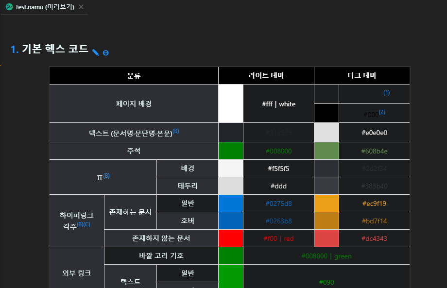
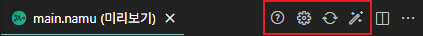
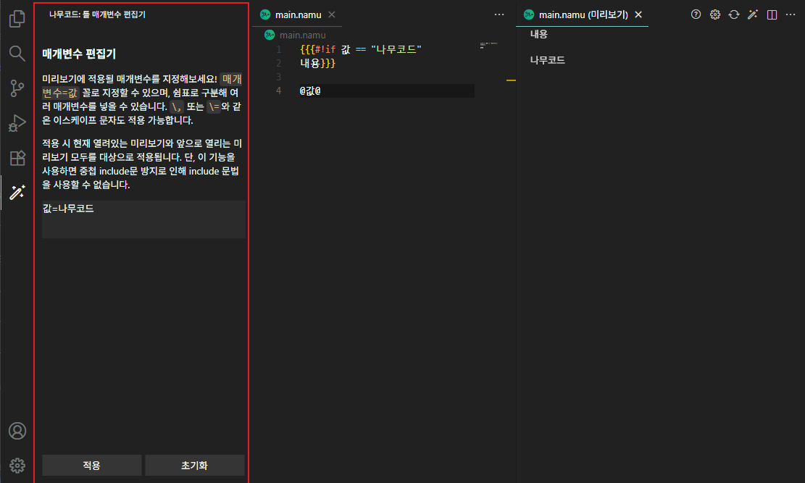

## 미리보기
|  |
| :---: |
| 미리보기 예시 |

- [미리보기](#미리보기)
- [상단 네비게이션 바 설명](#상단-네비게이션-바-설명)
- [틀 매개변수 편집기](#틀-매개변수-편집기)
- [미리보기 실행](#미리보기-실행)
- [include 문법 사용법](#include-문법-사용법)
  - [1. 틀 파일 만들기](#1-틀-파일-만들기)
  - [2. 사용하기](#2-사용하기)
- [이미지 삽입법](#이미지-삽입법)
  - [1. 이미지 파일 저장하기](#1-이미지-파일-저장하기)
  - [2. 사용하기](#2-사용하기-1)
- [파서 설정](#파서-설정)
- [FAQ: 자주 하는 질문](#faq-자주-하는-질문)
  - [Q. 미리보기 결과물이 the seed와 다릅니다.](#q-미리보기-결과물이-the-seed와-다릅니다)
  - [Q. 슬래시(/) 등 특수 문자가 들어간 문서는 어떻게 저장해야 하나요?](#q-슬래시-등-특수-문자가-들어간-문서는-어떻게-저장해야-하나요)
  - [Q. 메모리 사용량이 높습니다.](#q-메모리-사용량이-높습니다)
  - [Q. 파싱이 일정 블럭 깊이 넘어가면 되지 않습니다.](#q-파싱이-일정-블럭-깊이-넘어가면-되지-않습니다)
  - [Q. youtube, nicovideo, iframe이 제대로 표시되지 않습니다.](#q-youtube-nicovideo-iframe이-제대로-표시되지-않습니다)
  - [Q. 틀 매개변수 편집기 사용 중 "매개변수 형식이 잘못되었습니다"라고 뜹니다.](#q-틀-매개변수-편집기-사용-중-매개변수-형식이-잘못되었습니다라고-뜹니다)

## 미리보기 실행
미리보기를 할 문서 상단 네비게이션 바의 미리보기 버튼을 누르거나, `F1`을 누르고 `나무코드: 미리보기`를 선택해 미리보기를 실행할 수 있습니다.

## 상단 네비게이션 바 설명
|  |
| :---: |
| 미리보기 탭을 활성화 했을때 상단에 뜨는 메뉴 빨간색 네모 안의 4개의 버튼을 주목하세요. |

 * **첫번째 버튼: 미리보기 도움말 열기**: 이 도움말을 띄웁니다.
 * **두번째 버튼: 미리보기 설정 열기**: 미리보기와 관련된 설정을 엽니다. [파서 설정](#파서-설정)을 참고하세요.
 * **세번째 버튼: 미리보기 재시도**: 미리보기를 재시도합니다. 파서 설정을 바꿨거나, 작업 환경에 변경사항이 있거나(타 파일이 추가되었거나 수정된 경우) 하는 경우에 강제로 미리보기를 재시도할 수 있습니다. 원본 main.namu 파일이 수정되지 않으면 미리보기를 재시도하지 않기 때문에 이때 필요한 기능입니다.
 * **네번째 버튼: 틀 매개변수 편집기 열기**: [틀 매개변수 편집기](#틀-매개변수-편집기)를 표시합니다.

## 틀 매개변수 편집기
|  |
| :---: |
| 틀 매개변수 편집기 사용례 기본 왼쪽 Activity Bar의 마법봉 아이콘을 눌러 표시할 수 있음 **빨간색 네모**로 표시된 부분이 편집기 |

미리보기에 적용될 매개변수를 지정할 수 있습니다. `매개변수=값` 꼴로 쉼표로 구분해 여러 매개변수를 지정할 수 있습니다.

단, 이 기능을 사용하면 중첩 include문 방지로 인해 include 문법을 사용할 수 없습니다.

만약 오류가 발생한 경우 "[Q. 틀 매개변수 편집기 사용 중 "매개변수 형식이 잘못되었습니다"라고 뜹니다.](#q-틀-매개변수-편집기-사용-중-매개변수-형식이-잘못되었습니다라고-뜹니다)" FAQ를 참고하세요.
## include 문법 사용법
> 만약, Workspace Reference: 작업 환경 리소스 참조 여부가 활성화되어 있지 않다면 사용할 수 없는 기능입니다. 기본값은 활성화되어 있습니다. 아래의 [파서 설정](#파서-설정)을 참고하세요.

> 만약, [틀 매개변수 편집기](#틀-매개변수-편집기)의 값이 적용되었다면 중첩 include문 방지로 인해 include 문법을 사용할 수 없습니다.

### 1. 틀 파일 만들기
예를 들어, 문서 가져옴 틀을 만들려면 틀 파일을 생성해야 합니다. 파일명에는 콜론(:) 기호를 사용할 수 없으므로, 만약 `틀:문서 가져옴`이라면, `문서 가져옴.틀.namu`로 파일을 저장해야 합니다. 그리고, 그 파일은 틀을 사용할 다른 파일과 같은 작업 환경에 있어야 합니다.

### 2. 사용하기
이제 끝났습니다! 문서 가져옴 틀을 사용할 다른 파일(namu 형식의 파일)에서 `[include(틀:문서 가져옴, ~ )]`을 쓸 수 있습니다.

## 이미지 삽입법
> 만약, Workspace Reference: 작업 환경 리소스 참조 여부가 활성화되어 있지 않다면 사용할 수 없는 기능입니다. 기본값은 활성화되어 있습니다. 아래의 [파서 설정](#파서-설정)을 참고하세요.

### 1. 이미지 파일 저장하기
이미지 파일을 파일을 사용할 다른 파일과 같은 작업 환경에 저장하세요. 이미지 확장자는 `*.png`, `*.jpg`, `*.jpeg`, `*.gif`, `*.webp`, `*.svg`가 지원됩니다. 타 이미지는 지원하지 않습니다. 만약 `파일:이미지.png` 파일이었다면, `이미지.png`로 저장하면 자동으로 인식됩니다.

### 2. 사용하기
역시 끝났습니다! 이제 다른 파일에서도 이미지를 삽입해보세요!

## 파서 설정
미리보기는 파싱(Parsing)과 렌더링(Rendering)이라는 과정을 거칩니다. 나무코드에서는 이 과정에서 여러 설정을 지원합니다.

`F1`을 눌러 `나무코드: 미리보기 설정 열기`를 선택해 설정을 열 수 있습니다.

* **Do Warmup: 워밍업 여부** - 이 확장이 시작될 때, 미리 파서/렌더러를 돌려놓을 지(워밍업) 여부입니다. 시작 시 단 한 번 실행됩니다. 워밍업 될 경우, 캐싱이 되어 추후 미리보기를 실행할 때 더 빠르게 실행 가능합니다.
* **Max Length: 최대 글자수** - 미리보기 파서에서 문자 길이가 김을 판단하는 글자 수 기준입니다.
* **Max Parsing Timeout: 파싱 최대 대기 시간** - 미리보기 파서에서 문서 파싱을 기다리는 최대 시간(초)입니다.
* **Max Parsing Depth: 파싱 최대 깊이** - 미리보기 파서에서 문서 파싱 시 최대 얼마나 깊이 파싱될지 설정합니다.
* **Max Rendering Timeout: 렌더링 최대 대기 시간** - 미리보기 파서에서 문서 렌더링을 기다리는 최대 시간(초)입니다.
* **Workspace Reference: 작업 환경 리소스 참조 여부** - 미리보기 시 작업 환경에 있는 다른 namu 파일/이미지 파일을 불러옵니다. 활성화 시, 이미지 삽입과 분류, include 기능을 사용할 수 있습니다.

## FAQ: 자주 하는 질문
### Q. 미리보기 결과물이 the seed와 다릅니다.
현재 미리보기는 the seed를 모방한 [the tree 프로젝트](https://github.com/wjdgustn/thetree)의 코드를 가져와 기능을 지원 중인 상태입니다. 따라서 파싱 및 렌더링이 잘못된 경우 다른 결과물이 나올 수도 있습니다. 따라서, 만일 오류라고 생각되는 경우, [the tree 프로젝트의 이슈트래커](https://github.com/wjdgustn/thetree/issues)에 직접 제안 사항을 남기실 수 있습니다. 현재 **the tree@d3bb0a9**이 미리보기에 적용되어 있습니다!

### Q. 슬래시(/) 등 특수 문자가 들어간 문서는 어떻게 저장해야 하나요?
아쉽게도, 파일 관리의 한계로 인해 지원하지 않습니다. 따라서 특수 문자가 제거된 다른 이름을 사용해야 합니다. 하지만, 상위 문서와 하위 문서를 구분하는 슬래시는 제한적으로 사용할 수 있습니다.

만약 `나무코드/역사` 문서를 저장하고 싶다면, 상위 폴더를 `나무코드`로 지정하고, 그 폴더 안에 `역사.namu`를 넣으시면 됩니다!

### Q. 메모리 사용량이 높습니다.
실행 시 파서가 점유하는 메모리가 많아 사용량이 높아질 수 있습니다. 위의 [파서 설정](#파서-설정)의 **Do Warmup: 워밍업 여부**와 **Workspace Reference: 작업 환경 리소스 참조 여부**를 모두 체크 해제하세요. 비활성화 할 경우, 전자는 초반 최적화를 위한 메모리 점유를 끌 수 있고, 후자는 작업 환경 내의 다른 파일을 참조하지 않을 수 있습니다. 이때, 이미지 삽입, 분류, include 기능을 사용할 수 없습니다.

### Q. 파싱이 일정 블럭 깊이 넘어가면 되지 않습니다.
만약 #!wiki 문법 등 블럭으로 표현되는 깊이가 있는 문법들은 성능을 위해 최대 깊이의 제한이 존재합니다. 만약 이 깊이를 조금 더 깊게 하고 싶다면 **Max Parsing Depth: 파싱 최대 깊이**를 더 늘려보세요.

### Q. youtube, nicovideo, iframe이 제대로 표시되지 않습니다.
VS Code Webview 보안 정책상 한계로 iframe을 사용한 리소스들이 차단되어 표시되지 않습니다. 썸네일만 표시되고, 제대로 실행되지 않는 건 의도된 현상이며, 추후 해결 방법을 찾아보겠습니다.

### Q. 틀 매개변수 편집기 사용 중 "매개변수 형식이 잘못되었습니다"라고 뜹니다.
매개변수를 올바르게 썼는지 검토해보세요. 아래 문제 중 하나일 수 있습니다.
 * `매개변수=1, 매개변수2, 매개변수3=3`의 `매개변수2`와 같이 쉼표로 구분되어 값이 없고 매개변수만 있는 건 아닌지 확인해보세요. 매개변수만 있으면 안됩니다.
 * `매개변수=1,`처럼 마지막에 쉼표가 붙여져 있는지 확인해보세요. 맨 마지막에 쉼표가 붙여져 있으면 안됩니다.

