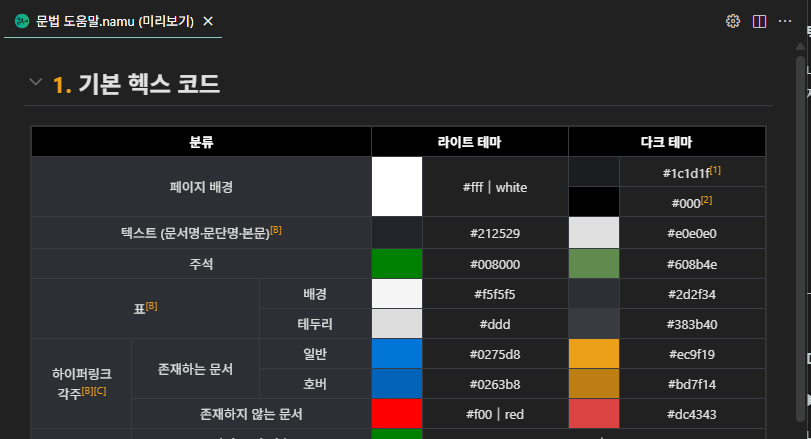

## 미리보기
|  |
| :---: |
| 미리보기 예시 |

 - [미리보기 실행 전 주의사항](#미리보기-실행-전-주의사항)
 - [미리보기 실행](#미리보기-실행)
 - [include 문법 사용법](#include-문법-사용법)
 - [이미지 삽입법](#이미지-삽입법)
 - [파서 설정](#파서-설정)
 - [FAQ: 자주 하는 질문](#faq-자주-하는-질문)
   - [Q. 슬래시(/) 등 특수 문자가 들어간 문서는 어떻게 저장해야 하나요?](#슬래시-등-특수-문자가-들어간-문서는-어떻게-저장해야-하나요)

## 미리보기 실행 전 주의사항
미리보기 기능을 실행하려면 Node.js 22 이상이 필요합니다. 이는 프로젝트에 포함된 isolated-vm 라이브러리 때문입니다. 따라서, 설치하지 않았다면 [Node.js 공식 사이트](https://nodejs.org)에서 Node.js 22 이상을 다운받아 설치하세요.

## 미리보기 실행
미리보기를 할 문서 상단 네비게이션 바의 미리보기 버튼을 누르거나, `F1`을 누르고 `나무코드: 미리보기`를 선택해 미리보기를 실행할 수 있습니다.

## include 문법 사용법
**※ 만약, Workspace Reference: 작업 환경 리소스 참조 여부가 활성화되어 있지 않다면 사용할 수 없는 기능입니다. 기본값은 활성화되어 있습니다. 아래의 [파서 설정](#파서-설정)을 참고하세요.**

### 1. 틀 파일 만들기
예를 들어, 문서 가져옴 틀을 만들려면 틀 파일을 생성해야 합니다. 파일명에는 콜론(:) 기호를 사용할 수 없으므로, 만약 `틀:문서 가져옴`이라면, `문서 가져옴.틀.namu`로 파일을 저장해야 합니다. 그리고, 그 파일은 틀을 사용할 다른 파일과 같은 작업 환경에 있어야 합니다.

### 2. 사용하기
이제 끝났습니다! 문서 가져옴 틀을 사용할 다른 파일(namu 형식의 파일)에서 `[include(틀:문서 가져옴, ~ )]`을 쓸 수 있습니다.

## 이미지 삽입법
**※ 만약, Workspace Reference: 작업 환경 리소스 참조 여부가 활성화되어 있지 않다면 사용할 수 없는 기능입니다. 기본값은 활성화되어 있습니다. 아래의 [파서 설정](#파서-설정)을 참고하세요.**

### 1. 이미지 파일 저장하기
이미지 파일을 파일을 사용할 다른 파일과 같은 작업 환경에 저장하세요. 이미지 확장자는 `*.png`, `*.jpg`, `*.jpeg`, `*.gif`, `*.webp`, `*.svg`가 지원됩니다. 타 이미지는 지원하지 않습니다. 만약 `파일:이미지.png` 파일이었다면, `이미지.png`로 저장하면 자동으로 인식됩니다.

### 2. 사용하기
역시 끝났습니다! 이제 다른 파일에서도 이미지를 삽입해보세요!

## 파서 설정
미리보기는 파싱(Parsing)과 렌더링(Rendering)이라는 과정을 거칩니다. 나무코드에서는 이 과정에서 여러 설정을 지원합니다.

`F1`을 눌러 `나무코드: 미리보기 설정 열기`를 선택해 설정을 열 수 있습니다.

* **Do Warmup: 워밍업 여부** - 이 확장이 시작될 때, 미리 파서/렌더러를 돌려놓을 지(워밍업) 여부입니다. 시작 시 단 한 번 실행됩니다. 워밍업 될 경우, 캐싱이 되어 추후 미리보기를 실행할 때 더 빠르게 실행 가능합니다.
* **Max Length: 최대 글자수** - 미리보기 파서에서 문자 길이가 김을 판단하는 글자 수 기준입니다.
* **Max Parsing Timeout: 파싱 최대 대기 시간** - 미리보기 파서에서 문서 파싱을 기다리는 최대 시간(초)입니다.
* **Max Rendering Timeout: 렌더링 최대 대기 시간** - 미리보기 파서에서 문서 렌더링을 기다리는 최대 시간(초)입니다.
* **Node Path: Node.js 실행 경로** - 미리보기 파서가 실행될 Node.js 실행 경로입니다.
* **Workspace Reference: 작업 환경 리소스 참조 여부** - 미리보기 시 작업 환경에 있는 다른 namu 파일/이미지 파일을 불러옵니다. 활성화 시, 이미지 삽입과 분류, include 기능을 사용할 수 있습니다.

## FAQ: 자주 하는 질문
### Q. 슬래시(/) 등 특수 문자가 들어간 문서는 어떻게 저장해야 하나요?
아쉽게도, 파일 관리의 한계로 인해 지원하지 않습니다. 따라서 특수 문자가 제거된 다른 이름을 사용해야 합니다. 하지만, 상위 문서와 하위 문서를 구분하는 슬래시는 제한적으로 사용할 수 있습니다.

만약 `나무코드/역사` 문서를 저장하고 싶다면, 상위 폴더를 `나무코드`로 지정하고, 그 폴더 안에 `역사.namu`를 넣으시면 됩니다!

### Q. 메모리 사용량이 높습니다.
실행 시 파서가 점유하는 메모리가 많아 사용량이 높아질 수 있습니다. 위의 [파서 설정](#파서-설정)의 **Do Warmup: 워밍업 여부**와 **Workspace Reference: 작업 환경 리소스 참조 여부**를 모두 체크 해제하세요. 비활성화 할 경우, 전자는 초반 최적화를 위한 메모리 점유를 끌 수 있고, 후자는 작업 환경 내의 다른 파일을 참조하지 않을 수 있습니다. 이때, 이미지 삽입, 분류, include 기능을 사용할 수 없습니다.